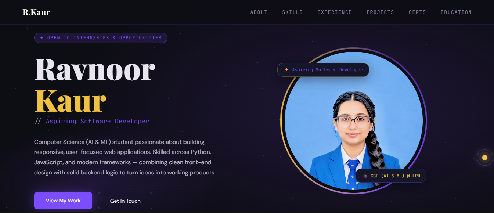
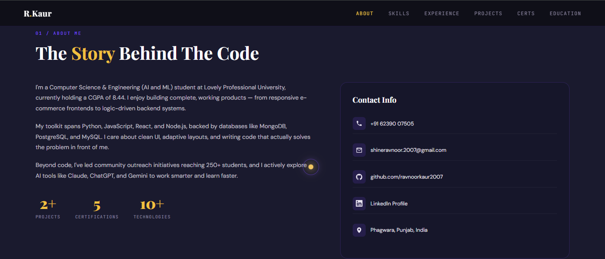
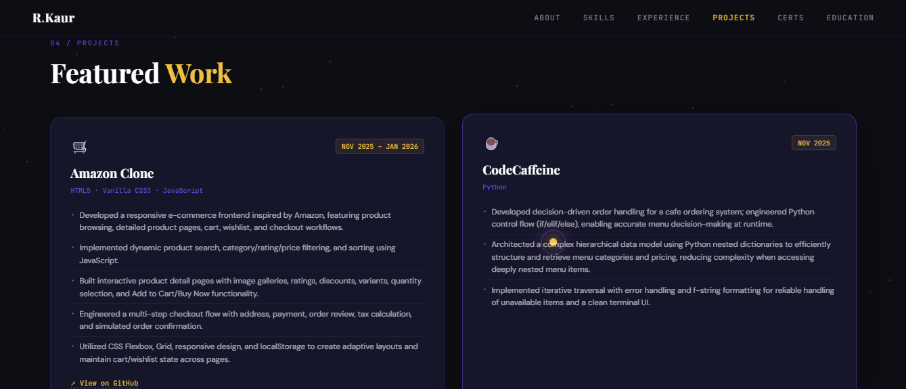

# 👩‍💻 Ravnoor Kaur — Developer Portfolio

> **Computer Science & Engineering (AI & ML) Student | Aspiring Software Developer**

A modern, responsive, and interactive personal portfolio built with **HTML5, CSS3, and Vanilla JavaScript** to showcase my technical skills, projects, certifications, education, and professional experience.

The portfolio represents my journey as a Computer Science & Engineering student and highlights my interest in **software development, web development, problem solving, and Artificial Intelligence & Machine Learning**.

---

## 🛠️ Built With


---

🌐 **Live Portfolio:**  
https://ravnoor-portfolio.vercel.app/

💻 **GitHub:**  
https://github.com/ravnoor-1407

💼 **LinkedIn:**  
http://www.linkedin.com/in/ravnoor-kaur-rk2007

---

## 🖥️ Portfolio Preview

### 🏠 Hero Section

The landing section introduces my professional profile, current career focus, and availability for internships and opportunities.



---

### 👩‍💻 About Me

The About section provides an overview of my academic background, technical interests, development experience, and professional contact information.



---

### 🚀 Featured Projects

The Projects section highlights selected development work along with the technologies used and key implementation details.



---

## 🚀 About Me

I am a **Computer Science & Engineering student specializing in Artificial Intelligence & Machine Learning** at Lovely Professional University.

I am passionate about building software and continuously improving my programming and problem-solving abilities.

My current areas of focus include:

- Software Development
- Web Development
- Data Structures & Algorithms
- Object-Oriented Programming
- Database Management
- Artificial Intelligence & Machine Learning

I enjoy transforming ideas into functional applications while learning new technologies and development practices.

---

## 🛠️ Technical Skills

### Programming Languages


### Web Development


### Databases


### Developer Tools


### Core Computer Science

`Data Structures & Algorithms` · `Object-Oriented Programming` · `Database Management Systems`

### Soft Skills

`Problem Solving` · `Communication` · `Teamwork` · `Time Management`

### AI Tools


---

## ⭐ Featured Projects

### 🛒 Amazon Clone

A responsive e-commerce frontend inspired by Amazon, developed to practice real-world frontend development, interactive UI design, and client-side application logic.

#### Key Features

- Responsive multi-page e-commerce interface
- Product browsing and detailed product pages
- Dynamic product search
- Category, rating, and price filtering
- Product sorting
- Shopping cart functionality
- Wishlist functionality
- User authentication interface
- Multi-step checkout workflow
- LocalStorage-based client-side state persistence

**Tech Stack:**

`HTML5` · `CSS3` · `Vanilla JavaScript` · `LocalStorage`

🔗 **Repository:**  
https://github.com/ravnoor-1407/Amazon-Clone

---

### ☕ CodeCaffeine

A Python-based café ordering system developed to strengthen programming fundamentals, structured data handling, decision-making, and problem-solving.

#### Key Features

- Menu and order management
- Nested dictionary-based data organization
- Conditional decision-making
- Iterative data traversal
- Input handling
- Error handling
- Terminal-based user interaction
- Dynamic order processing

**Tech Stack:**

`Python`

🔗 **Repository:**  
https://github.com/ravnoor-1407/CodeCaffeine

---

## 💼 Experience

### Community Development Intern

**Times of India — Environment Awareness Campaign**

Participated in a community development initiative focused on **environmental awareness, student engagement, and community outreach** across government schools.

#### Key Contributions

- Conducted environmental awareness sessions for students.
- Participated in cleanliness and plant-watering activities.
- Conducted educational and awareness sessions.
- Organized interactive activities with students.
- Supported student registration for the **Times Critical Thinking Championship (TCTC) 2026**.
- Maintained student information for backend verification.
- Participated in sports, painting, and student engagement activities.
- Worked collaboratively with team members during community outreach activities.

#### Skills Developed

`Communication` · `Presentation` · `Teamwork` · `Leadership` · `Event Coordination` · `Data Management`

---

## 🎓 Education

### Bachelor of Technology — Computer Science & Engineering (AI & ML)

**Lovely Professional University, Punjab**

**CGPA: 8.44**

---

### Senior Secondary — Class XII, Science

**Swami Sant Dass Public School, Phagwara, Punjab**

**Percentage: 82%**

---

### Matriculation — Class X, Science

**Swami Sant Dass Public School, Phagwara, Punjab**

**Percentage: 91%**

---

## 📜 Certifications & Achievements

My portfolio includes professional certifications and learning achievements across technology and professional development.

### Selected Certification

**Introduction to Artificial Intelligence**  
**Infosys Springboard** · March 2026

Additional certifications are available on the live portfolio.

🌐 **View all certifications:**  
https://ravnoor-portfolio.vercel.app/#certifications

---

## 📊 Portfolio Highlights

| Category | Details |
| :--- | :--- |
| 🎓 Degree | B.Tech CSE (AI & ML) |
| 📈 CGPA | **8.44** |
| 💻 Featured Projects | **2+** |
| 📜 Certifications | **5** |
| 🛠️ Technologies | **10+** |
| 🌐 Deployment | **Vercel** |
| 📦 Version Control | **Git & GitHub** |

---

## 💡 What This Portfolio Demonstrates

This project demonstrates my ability to:

- Build responsive websites using HTML5 and CSS3.
- Develop interactive interfaces using Vanilla JavaScript.
- Implement modern layouts using Flexbox and CSS Grid.
- Create CSS-based animations and visual effects.
- Manipulate the DOM using JavaScript.
- Design user-focused interfaces.
- Structure and present technical projects professionally.
- Use Git and GitHub for version control.
- Deploy a production-ready static website using Vercel.
- Maintain and continuously improve a personal software project.

---

## 🎨 Design & Interactive Features

The portfolio combines a dark, modern visual style with interactive frontend elements.

### Visual Design

- Dark developer-focused interface
- Gold and purple accent palette
- Responsive layouts
- Custom typography
- Card-based content presentation
- Structured section navigation

### Interactive Features

- Animated shooting-star background
- Custom cursor interaction
- Cursor trail effect
- Scroll reveal animations
- Active navigation highlighting
- Smooth scrolling between sections
- Interactive project and certification links

---

## 🧰 Tech Stack

### Structure

**HTML5**

Used to create the semantic structure and content hierarchy of the portfolio.

### Styling

**CSS3**

Used for:

- Responsive layouts
- Flexbox
- CSS Grid
- Custom properties
- Typography
- Transitions
- Keyframe animations
- Media queries

### Application Logic

**Vanilla JavaScript**

Used for:

- DOM manipulation
- Interactive animations
- Scroll-based effects
- Navigation behavior
- Custom cursor interactions
- Dynamic visual elements

### Deployment

**Vercel**

Used to host and deploy the production version of the portfolio.

### Version Control

**Git & GitHub**

Used to manage source code, commits, and project history.

---

## 📂 Project Structure

```text
Ravnoor-Portfolio/
│
├── Screenshots/
│   ├── 01-hero.png
│   ├── 02-about.png
│   └── 03-projects.png
│
├── Professional_Headshot_ZoomedOut.jpeg
├── index.html
├── style.css
├── script.js
└── README.md
```

### File Overview

| File / Folder | Purpose |
| :--- | :--- |
| `Screenshots/` | Portfolio preview images displayed in this README |
| `Professional_Headshot_ZoomedOut.jpeg` | Profile image used in the portfolio |
| `index.html` | Main portfolio structure and content |
| `style.css` | Layout, styling, responsiveness, and animations |
| `script.js` | Interactive JavaScript functionality |
| `README.md` | Project documentation |

---

## ⚙️ Run Locally

Because this portfolio is a static frontend project, no backend server or package installation is required.

### 1. Clone the repository

```bash
git clone https://github.com/ravnoor-1407/Ravnoor-Portfolio.git
```

### 2. Navigate to the project

```bash
cd Ravnoor-Portfolio
```

### 3. Open the project

Open the project in **Visual Studio Code**.

You can either open `index.html` directly in your browser or use the **Live Server** extension for development.

### Recommended Development Setup

1. Open the project in Visual Studio Code.
2. Install the **Live Server** extension.
3. Right-click `index.html`.
4. Select **Open with Live Server**.
5. Make your changes and preview them instantly in the browser.

---

## 🚀 Deployment

The portfolio is deployed using **Vercel** and connected to the GitHub repository.

```text
Visual Studio Code
        ↓
       Git
        ↓
     GitHub
        ↓
     Vercel
        ↓
  Live Portfolio
```

### Production Website

🌐 **https://ravnoor-portfolio.vercel.app/**

Changes pushed to the `main` branch can automatically trigger a new deployment through Vercel.

---

## 🔄 Development Workflow

After making changes to the portfolio:

```bash
git status
```

Stage the changes:

```bash
git add .
```

Create a commit:

```bash
git commit -m "Update portfolio"
```

Push the changes:

```bash
git push
```

The updated code is then available in the GitHub repository and can be automatically deployed through Vercel.

---

## 🧠 What I Learned

Building this portfolio strengthened my understanding of both frontend development and professional project presentation.

### Responsive Web Development

Learned how to create layouts that adapt across desktop, tablet, and mobile devices using CSS Grid, Flexbox, and responsive media queries.

### JavaScript Interactivity

Practiced DOM manipulation, event handling, dynamic element creation, and browser-based interactions.

### UI/UX Design

Improved my understanding of visual hierarchy, typography, spacing, contrast, cards, navigation, and interactive feedback.

### Animation & Visual Effects

Implemented animated backgrounds, cursor effects, scroll reveals, transitions, and other micro-interactions to create a more engaging user experience.

### Version Control

Practiced Git workflows including:

- Repository initialization
- Staging
- Commits
- Branch management
- Remote repositories
- Pulling and merging
- Pushing changes to GitHub

### Deployment

Learned how to connect a GitHub repository to Vercel and deploy a production-ready static website.

### Professional Presentation

Learned how to present my technical projects, academic background, certifications, and experience through a single professional online platform.

---

## 🎯 Current Focus

I am currently focused on expanding my skills through:

- Building more full-stack projects
- Strengthening Data Structures & Algorithms
- Improving JavaScript and React skills
- Learning backend development
- Exploring Artificial Intelligence & Machine Learning
- Developing projects suitable for internships and placements

---

## 📈 Future Improvements

Planned improvements for the portfolio include:

- Adding more full-stack projects
- Expanding the project showcase
- Adding detailed project case studies
- Improving accessibility
- Further optimizing mobile responsiveness
- Adding more AI/ML-focused projects
- Continuously updating certifications and achievements

---

## 🤝 Connect With Me

I am open to **internships, learning opportunities, collaborations, and software development opportunities**.

📧 **Email:**  
shineravnoor.2007@gmail.com

💻 **GitHub:**  
https://github.com/ravnoor-1407

💼 **LinkedIn:**  
http://www.linkedin.com/in/ravnoor-kaur-rk2007

🌐 **Portfolio:**  
https://ravnoor-portfolio.vercel.app/

---

## ⭐ Support

If you find this project interesting, consider giving the repository a ⭐ on GitHub.

> **Built with curiosity, consistency, and a passion for learning and building.**

---

### 👩‍💻 Ravnoor Kaur

**B.Tech CSE (AI & ML) | Aspiring Software Developer**
